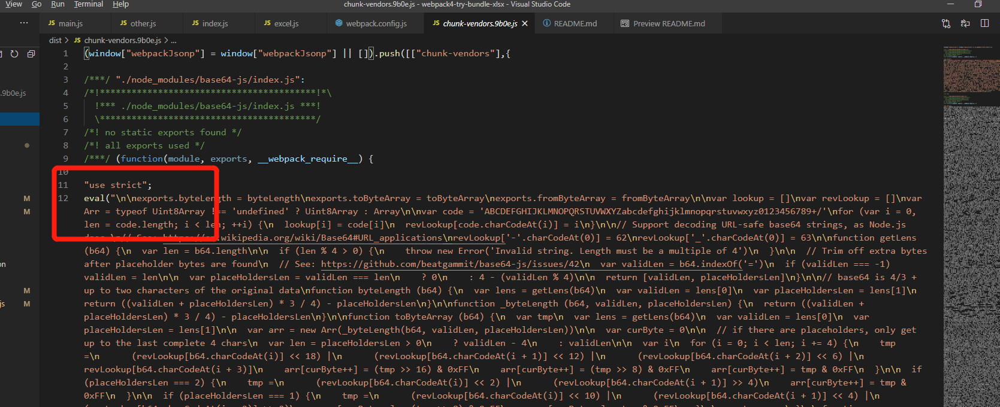
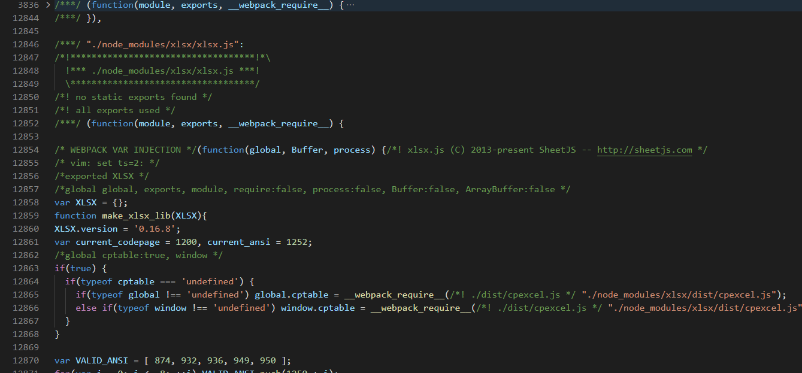

# 🚀 Welcome to your new awesome project!

## 够全的webpack4配置
Thk for 传送门 [点这里](https://blog.csdn.net/github_34708151/article/details/103900725)


## 脑仁疼的细节😱

### 1. 😱😱😱 默认下来的打包模式，开始用的`eval`，可读性太难了
before: 感受一下痛苦：



after: 这样配置一下就好：
```js
module.exports = {
  devtool: 'none',
}
```
感受一下世界的美好：



把总结写进去就完事儿了。。。。。。。。。。。。。。。。。。。。。。。。。。。。。。。。。。。。。。。


## small tips
### 1. vue中的alias`@/` 代表`xxx/xx/xxx/src`  是resolve的配置解析策略
