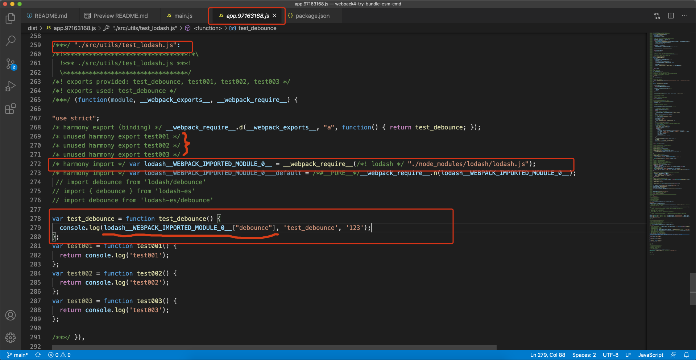
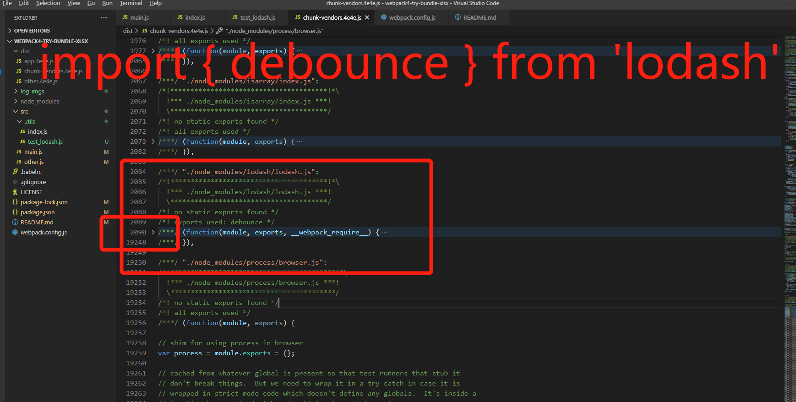
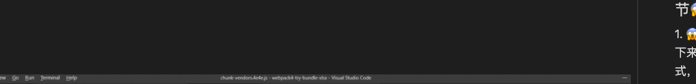
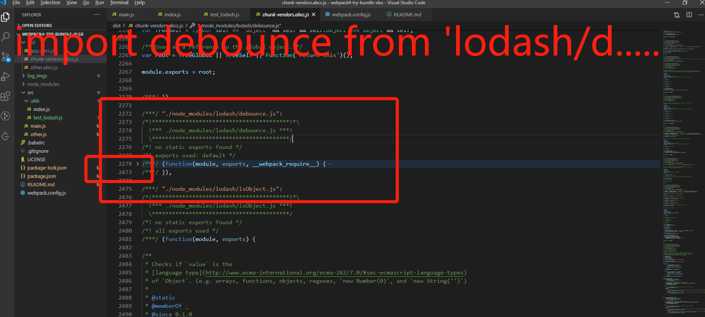
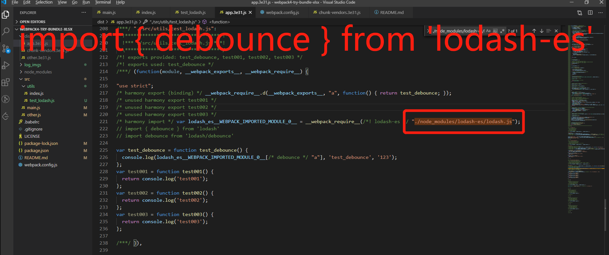
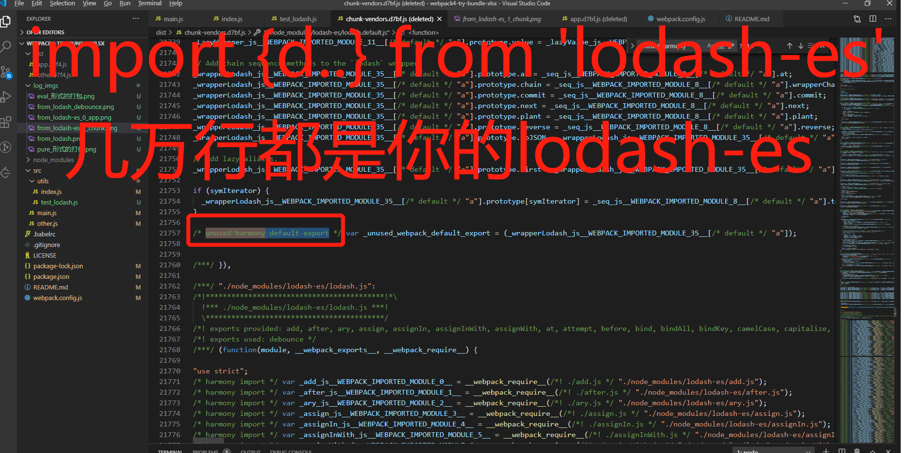
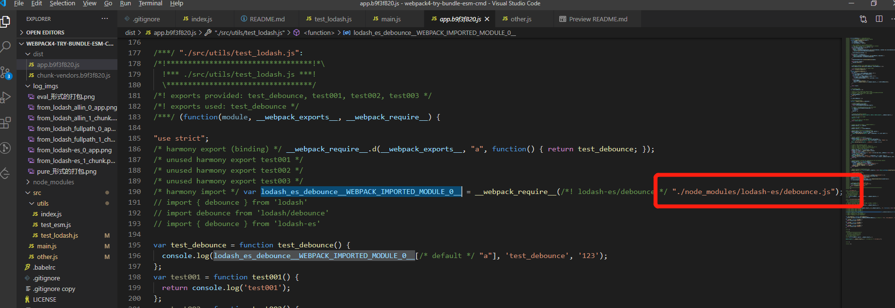
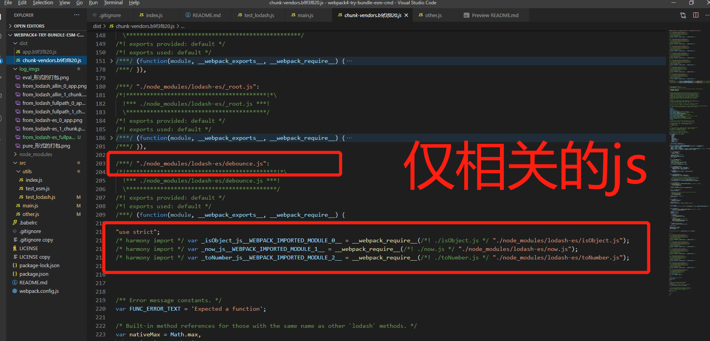

# 🚀 Welcome to webpack4-try-bundle-esm-cmd

`lodash` 和 `lodash-es`是一个很好的实验对象。

Thk for 传送门 [够全的webpack4配置](https://blog.csdn.net/github_34708151/article/details/103900725)


## 🙄 Targe 
1. 分析webpack4打包文件代码，查看cmd、esm打包区别。
2. lodash和lodash-es正好作为实验对象。
3. lodash最佳使用推荐，以及推荐理由

## 🤔 Try 几个场景
### - Try000 cmd: 全引入lodash，`import { debounce } from 'lodash'`
1. app.js 中会引入的是`整个lodash文件`
2. chunk.js 中近`2w`行的lodash代码，且没有`ununsed harmony`标识，意味着不会被shaking掉





### - Tyr001 cmd: 全路径引入lodash某方法，`import debounce from 'lodash/debounce'`
1. app.js 中会引入的是`lodash/debounce`文件。对比Try000，仅引入了相关代码
2. chunk.js 中近`400`行的lodash代码，且没有`ununsed harmony`标识，意味着不会被shaking掉
3. lodash的打包代码量明显减小：`2w->400` 🤙🏻🤙🏻🤙🏻





### - Try010 esm: 全引入lodash，`import { debounce } from 'lodash-es'`
1. app.js 中会引入的是`整个lodash-es文件`
2. chunk.js 中近`2w`行的lodash代码，且有`ununsed harmony`标识，意味着shaking





### - Tyr011 esm: 全路径引入lodash某方法，`import debounce from 'lodash-es/debounce'`
1. app.js 中会引入的是`lodash-es/debounce`文件。对比Try010，仅引入了相关代码
2. chunk.js 中近`500`行的lodash代码，且没有`ununsed harmony`标识，意味着不会被shaking掉，且 没有垃圾冗余代码
3. lodash的打包代码量明显减小：`2w->500` 🤙🏻🤙🏻🤙🏻





## 给手给手
如果使用`全引入`的形式，推荐lodash-es，虽然lodash、lodash-es两者都会把全部文件进行bundle，但是lodash-es可以进行shaking

如果使用`全路径引入`的形式，推荐lodash-es > lodash，区别不大。因为lodash源码层面已经将函数拆分的很细，通过组装的形式来完成

虽然lodash-es `全引入` 和 `全路径引入` 最终结果相同，但是 `全路径引入` 能够提高打包时效：节约打包+shaking
最终推荐 lodash-es全路径引入 -> lodash全路径引入 -> lodash-es -> lodash + lodash-webpack-plugin


## small tips
### 1. vue中的alias`@/` 代表`xxx/xx/xxx/src`  是resolve的配置解析策略

### 2. webapck4 init生成的配置方案中，开发模式下的打包默认是`eval`，打包文件可读性太难了
default 配置，来感受一下：


调整一下配置，整个世界都变的美好：
```js
module.exports = {
  devtool: 'none',
}
```

